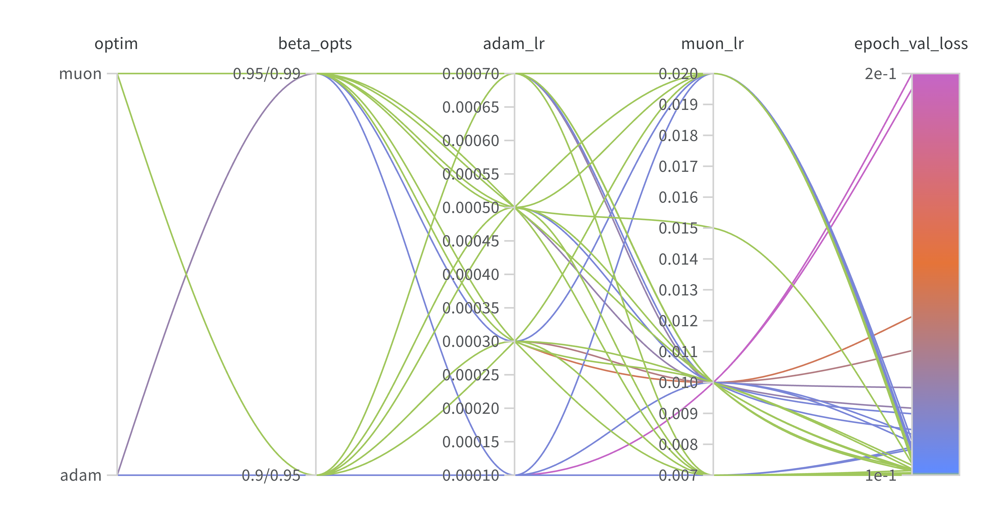
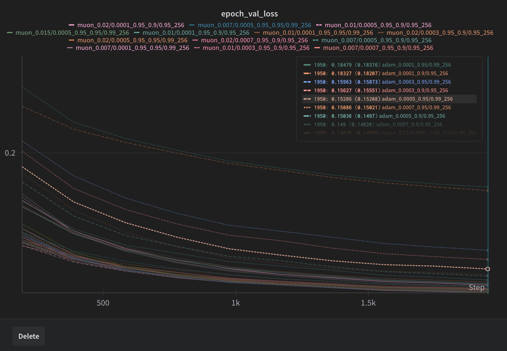
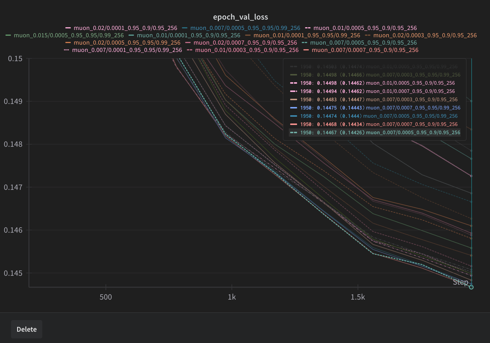

# Adam less diffusion


This repository contains a minimal implementation of comparing adam with non-adam optimizers , for now it's muon, most of the code here is from @cloneofsimo's minRF repository, I have just added the optimizers, sweeps and some other minor changes.

I initially thought muon might struggle with diffusion since there's a lot of gradient noise, but it seems to be doing fine, I will be adding more optimizers and datasets to this repo, prs are welcome.





# 1. Adam vs New Optimizers (??)

Install torch, pil, torchvision and muon!

```
pip install torch torchvision pillow git+https://github.com/KellerJordan/Muon
```

Run

If you are cool and want to train CIFAR instead, you can do that.

```bash
python rf.py --cifar --muon_lr 0.01 --adam_lr 0.001 --momentum 0.9 --optim muon --beta_option "0.9/0.95" --batch_size 256
```

You should be using ./sweep.sh to run the sweeps, make sure to adjust based on how much gpus u got,
```bash 
# on sweep.sh find and adjust these
number_of_gpus=8
jobs_per_gpu=2
```

then do
```
./sweep.sh
```

(much of this work is based on @cloneofsimo's minRF repository)
# Citations

```bibtex
@misc{ryu2024minrf,
  author       = {Simo Ryu},
  title        = {minRF: Minimal Implementation of Scalable Rectified Flow Transformers},
  year         = 2024,
  publisher    = {Github},
  url          = {https://github.com/cloneofsimo/minRF},
}
```